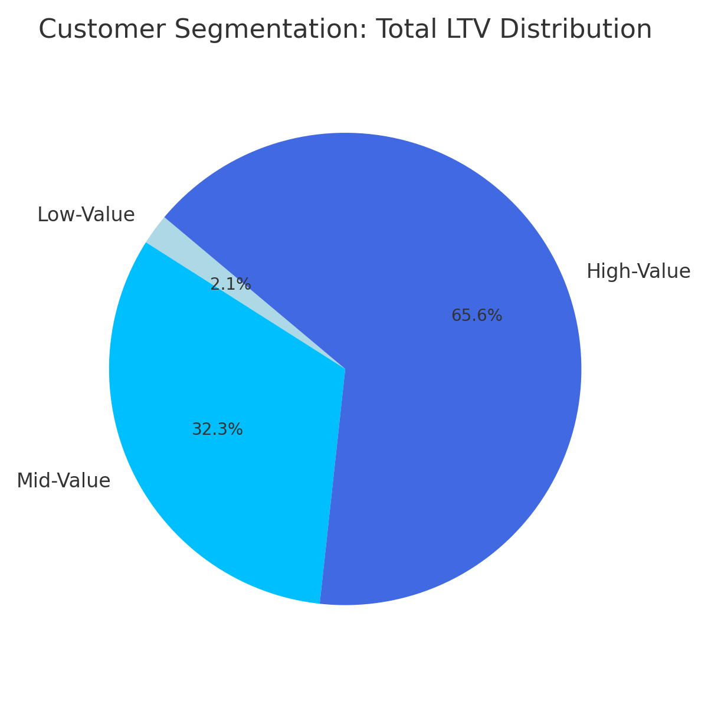
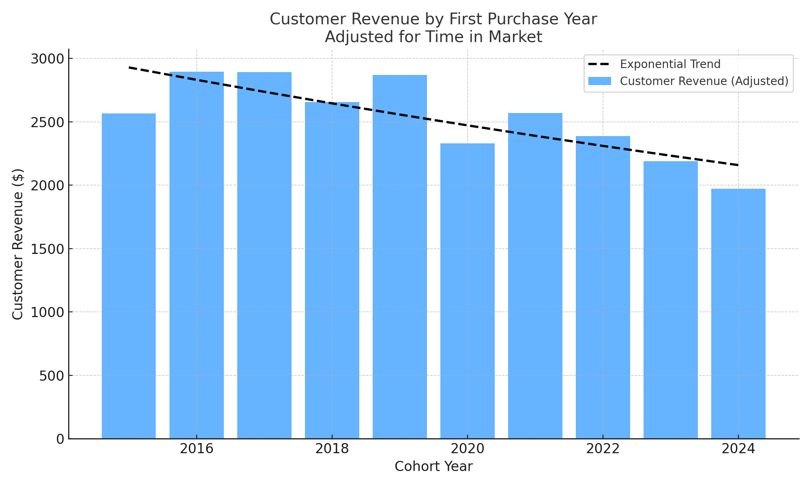

# Intermediate SQL - Sales Analysis 
## Overview

## Business Questions
1. **Customer Segmentation:** Who are our most valuable customers?
2. **Cohort Analysis:** How do different customer groups generate revenue?
3. **Retention Analysis:** Which customers haven't purchased recently?

## Analysis Approach
### 1. Customer Segmentation Analysis
- Categorized customers based on total lifetime value (LTV)
- Assigned customers to High, Mid, and Low-value segments
- Calculated key metrics: total revenue

🖥️ Query: [1_customer_segmentation.sql](1_customer_segmentation.sql)

**📈 Visualization:**

📊 **Key Findings:**
- High-value segment (25% of customers) drives 66% of revenue ($135.4M)
- Mid-value segment (50% of customers) generates 32% of revenue ($66.6M)
- Low-value segment (25% of customers) accounts for 2% of revenue ($4.3M)

💡 **Business Insights**
- High-Value (66% revenue): Offer premium membership program to 12,372 VIP customers, as losing one customer significantly impacts revenue
- Mid-Value (32% revenue): Create upgrade paths through personalized promotions, with potential $66.6M → $135.4M revenue opportunity
- Low-Value (2% revenue): Design re-engagement campaigns and price-sensitive promotions to increase purchase frequency

### 2. Cohort Analysis
- Tracked revenue and customer count per cohorts
- Cohorts were grouped by year of first purchase
- Analyzed customer retention at a cohort level

🖥️ Query: [2_cohort_analysis.sql](/2_cohort_analysis.sql)

**📈 Visualization:**

📊 **Key Findings:**
- The exponential trend line highlights a consistent drop in revenue per customer from 2019 onward.
- The 2023 and 2024 cohorts show the lowest customer revenue in the last 10 years.
- Although total net revenue is increasing, this is likely due to a larger number of customers. That growth does not reflect improved customer value, which is actually declining.

💡 **Business Insights**
- The value extracted from each customer is declining over time, as seen in the downward trend of customer revenue by cohort. This suggests newer customers are less valuable and calls for deeper investigation into acquisition channels, onboarding experience, and product-market fit.
- In 2023 we saw a drop in number of customers acquired, which is concerning.
- With falling LTV and acquisition, the company faces a potential revenue downturn.

### 3. Customer Retention

🖥️ Query: [3_retention_analysis.sql](3_retention_analysis.sql)

**📈 Visualization:**

📊 **Key Findings:**  

💡 **Business Insights:**

## Strategic Recommendations

1. **Customer Value Optimization** (Customer Segmentation)

2. **Cohort Performance Strategy** (Customer Revenue by Cohort)

3. **Retention & Churn Prevention** (Customer Retention)

## Technical Details
- **Database:** PostgreSQL
- **Analysis Tools:** PostgreSQL, PGadmin
- **Visualization:** 